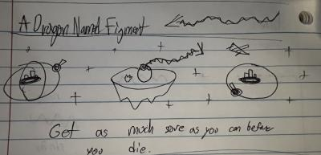

# A Dragon Named Figment

This the repo for the game I created for [Brackey's Game Jam 7](https://itch.io/jam/brackeys-7), A Dragon Named Figment.
The theme of the jam was "It Is Not Real", and after a while of thought I ended up creating this arcadey space exploration and combat game
where you play as a dragon named Figment who is slowly fading from existence.

As you fade away or take damage your tail shrinks until you are gone forever, where you then have to restart the game with the knowledge you have gained.
Inspired by the SNES Starfox!

I focused on getting the MVP done, ensuring the game was easily expandible with clean code architecture, and after that I am planning on using the other half of my time polishing visuals!
We will see how far I get on that :)

Attributions:
Audio
"UI Confirmation Alert, A3.wav" by InspectorJ (www.jshaw.co.uk) of Freesound.org

"Last Push" by Jay Man - OurMusicBox
"Wrath Of Sin" by Jay Man - OurMusicBox
https://www.our-music-box.com/
https://www.youtube.com/c/ourmusicbox/ 
